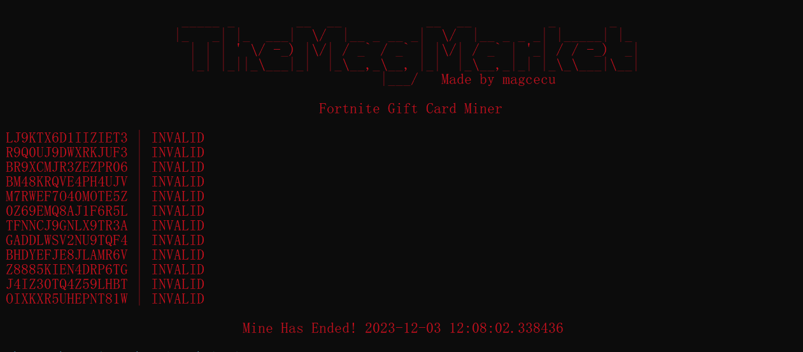

# Fortnite-gift-card-generator
Gift card/ Vbucks generator made in python. Uses requests to the official api.
<p align="center">
  
</p>
# How it works
* Generates a random 16 digit string with the with the same list used in the official gift cards
* Requests it to the api and waits for a code return
* The code is eather for valid or invalid IF THE CODE IS VALID IT WILL BE SAVED IN A TXT FILE IN THE SAME DIRECTORY!
* Will check for errors and if an error returns in the process you will be notified

# Dont get scammed
This is the official repostory of The Mag Market and it is out for free as we dont usually do stuff involved with gaming. Anywhere else you get a simmular looking script its most likely an unlicensed copy and if you have paid money you have been scammed!

# How to install
Because im pretty sure that all of you have no knowage or what so ever i will give an in dept step by step
* Have to have pyhton 3
* Place all the files on your desktop
* Open your terminal and locate Desktop
* Input
```
pip install -r requirements.txt
```
* Run your file
```
py main.py
```
* Enjoy
# For any help / questions / requests
Contact me [here](https://discord.gg/GhCpAc7G)!
# Contributors 
MagCecu

# External links
* https://t.me/OneandOnlyMag
* https://discord.gg/GhCpAc7G
